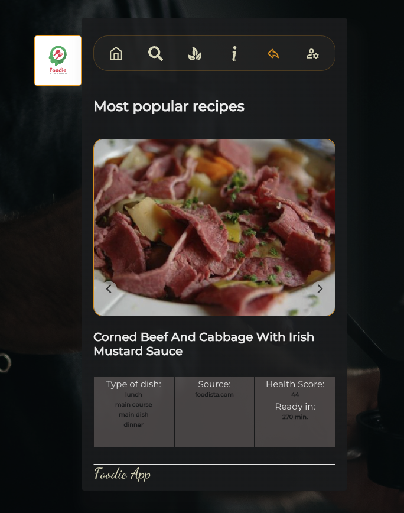
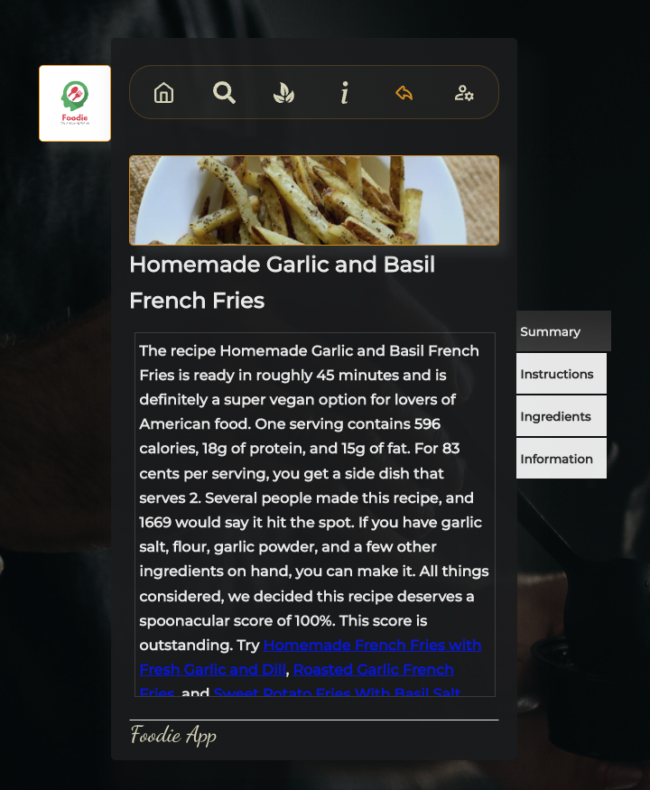
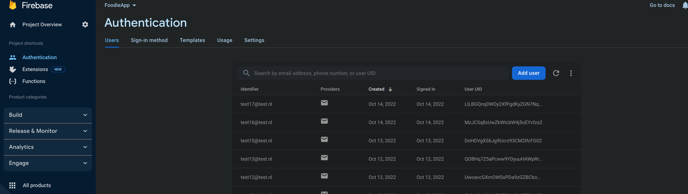

Inleiding:

Foodie App is een webapplicatie waarmee je wat handige elementen / functionaliteiten bij elkaar hebt om snel keuzes te
maken in het proces van eten uitzoeken en daarbij snel overzicht te hebben in wat je ervoor nodig hebt / voor moet
doen. Hoe gezond is het en past het in mijn voedingseisen?

De data komt uit Spoonacular en wordt verkregen met diverse end points uit deze API.

https://spoonacular.com/food-api/docs

De App:

Onderstaande screenshot laat de homepage zien. Je krijgt automatisch een aantal (6) populaire recepten in een slider te
zien. Daaronder worden hoog over details van de gerechten getoond om een eerste snelle selectie te kunnen maken. Als je
hier toevallig al een gerecht ziet waar je meer van wilt weten klik je op de foto en krijg je detail / recept informatie
te zien.

In de navigatie bar vind je de respectievelijk home, zoek functie, healthy filters, informatie over de app, back button
en de account icon.

De zoek functie wijst voor zich. Voer een ingredient of voedselsoort in en vind de daarbij horende resultaten.
De healthy filter page laat zo'n 30 recepten zien onder het filter dat rechts in het scherm geselecteerd kan worden.

Telkens als je dat doet, vraagt de app 30 nieuwe recepten op, doe dit in dit geval niet te vaak anders ben je zo door de
max van de API heen. Ook hier kan je doorklikken naar recept details.

Hieronder kan je een screenshot zien van de recept detail page. Hier kan je een selectie doen aan de rechterkant van het
scherm op: Summary, Instructions, Ingredients en Information. Een leuk detail is dat je de Ingredient lijst kunt
gebruiken als boodschappenlijst dat je netjes kunt afvinken als je door de supermarkt loopt.

De links in de beschrijvingen brengen je naar de externe bron van het recept. Daar kan je vaak nog meer leuke dingen
vinden over het betreffende gerecht.

-----------------------

De applicatie starten:

Als je het project gecloned hebt naar jouw locale machine, installeer je eerst de node_modules door het volgende
commando in de terminal te runnen:

npm install

Wanneer dit klaar is, kun je de applicatie starten met behulp van:

npm start

API keys / .env
Ik heb in mijn code de API keys beveiligd middels een .env. Deze heb ik in mijn gitignore staan, maar hij neemt hem vaak
toch nog mee naar Git.

Vanwege de beperkte quotum op de API heb ik meerdere accounts en dus API keys. Mocht het zo zijn dat er een volloopt
door gebruik kan ik makkelijk een nieuwe aanleveren.

Routes / Pages
De route structuur heb ik in de Pages file gestopt. Dit houdt de APP.js overzichtelijk voor andere elementen.

Registratie / Inlog
Ik heb ervoor gekozen om met Firebase de registratie en inlog te doen. Dit omdat ik op basis van de gegevens die online
staan in Git en EdHub onvoldoende verder kwam en moest wachten op de lessen hierover. Ongeduldig en nieuwsgierig als ik
ben, ben ik toen maar tutorials gaan kijken over Firebase en dat is mij gelukt aan de praat te krijgen. Fijne
functionaliteit die ik later graag weer gebruik en makkelijk kan uitbreiden.

Ik zal de betreffende docent toe kunnen laten tot Firebase omgeving:

Je kunt je eigen email en ww gebruiken om een account aan te maken. Na dit op de juiste manier te doen word je
automatisch geredirect naar de inlog pagina en kan je inloggen met je gegevens. Er verschijnt een alertbox als je
succesvol geregistreerd bent en die redirect je automatisch door na 5 seconden naar de inlogpagina. Na inloggen kom je
op de boven getoonde home.

Een test account is: test2@test.nl en ww: 1234567, maar maak er gerust zelf een aan. Omdat de procedure nog niet
helemaal 100% is, maar puur voor eerste illustratie van registreren en inloggen blijft je ww zichtbaar als je het
invult. Dit is een van de dingen die ik later nog zou uitbreiden, evenals de opties om met social media accounts in te
kunnen loggen.

Onder het icoon account kan je zien met welk email adres je bent ingelogd en eventueel uitloggen. Je gegevens worden dan
weer gewist uit de localStorage.

De alerts in de app had ik eerst geschreven op de systeem alerts, maar die vond ik niet mooi. Deze zijn zelf gebouwd en
gestyled. Ik heb onderscheid in error alerts en dialogue alerts die aangeven wanneer iets succesvol is bijvoorbeeld.

Ik hoop dat je kan genieten van het eindresultaat. Ik heb vele kleine en grote overwinningen gehad in dit proces :).

